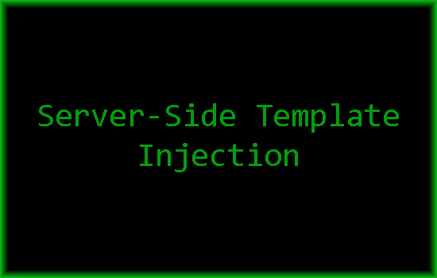

# SSTI (Server-Side Template Injection)



---
## Table:

* [WHOIS](#whois)
* [DETECT](#detect)
    * [Detect - Plaintext context](#detect---plaintext-context)
    * [Detect - Plaintext context](#detect---code-context)
* [EXPLOIT](#exploit)
    * [Read](#read)
    * [Explore](#explore)
    * [Attack](#attack)
* [TOOLS](#tools)
* [REF]()

## WHOIS

A server-side template injection occurs when an attacker is able to use native template syntax to inject a malicious payload into a template, which is then executed server-side.

___Template engines___ are designed to ___generate web___ pages by ___combining fixed___ templates with volatile data. Server-side template injection attacks can occur when ___user input___ is concatenated directly ___into a template___, rather than passed in as data. This allows attackers to ___inject arbitrary template directives___ in order to manipulate the template engine, often enabling them to take ___complete control of the server___.

---

## DETECT

As with any vulnerability, the first step towards exploitation is being able to find it. Perhaps the simplest initial approach is to try ___fuzzing the template___ by injecting a sequence of special characters commonly used in template expressions, such as the polyglot `${{<%[%'"}}%\\`.

In order to check if the server is vulnerable you should spot the ___differences___ between the response with regular data on the parameter and the ___given payload___.

If an ___error is thrown___ it will be quiet easy to figure out that ___the server is vulnerable___ and even which ___engine is running___. But you could also find a vulnerable server if you were ___expecting___ it to ___reflect___ the given payload and it is not being ___reflected___ or if there are some ___missing chars___ in the response.

* ### Detect - Plaintext context

    The given input is being ___rendered and reflected___ into the response. This is easily ___mistaken for a simple___ [XSS](https://book.hacktricks.xyz/pentesting-web/xss-cross-site-scripting) vulnerability, but it's easy to differentiate if you try to set ___mathematical operations___ within a template expression:

    ```
    {{7*7}}
    ${7*7}
    <%= 7*7 %>
    ${{7*7}}
    #{7*7}
    ```

* ### Detect - Code context
    In these cases ___the user input___ is being placed ___within a template expression___:

    ```
    engine.render("Hello {{"+greeting+"}}", data)
    ```
    The URL access that page could be similar to: `http://vulnerable-website.com/?greeting=data.username`

    If you ___change___ the `greeting` parameter for a ___different value the response won't contain the username___, but if you access something like: `http://vulnerable-website.com/?greeting=data.username}}hello` then, ___the response will contain the username___ (if the closing template expression chars were `}}`).
    If an ___error___ is thrown during these test, it will be easier to find that the server is vulnerable.

## EXPLOIT

* ### Read

    The first step after finding template injection and identifying the template engine is to read the documentation. Key areas of interest are:
    * 'For Template Authors' sections covering basic syntax.
    * 'Security Considerations' - chances are whoever developed the app   you're testing didn't read this, and it may contain some useful hints.
    * Lists of builtin methods, functions, filters, and variables.
    * Lists of extensions/plugins - some may be enabled by default.

* ### Explore

    Assuming no exploits have presented themselves, the next step is to explore the environment to find out exactly what you have access to. You can expect to find both default objects provided by the template engine, and application-specific objects passed in to the template by the developer. Many template systems expose a 'self' or namespace object containing everything in scope, and an idiomatic way to list an object's attributes and methods.

    If there's no builtin self object you're going to have to bruteforce variable names using [SecLists](https://github.com/danielmiessler/SecLists/blob/25d4ac447efb9e50b640649f1a09023e280e5c9c/Discovery/Web-Content/burp-parameter-names.txt) and Burp Intruder's wordlist collection.

    Developer-supplied objects are particularly likely to contain sensitive information, and may vary between different templates within an application, so this process should ideally be applied to every distinct template individually.

* ### Attack 

    At this point you should have a firm idea of the attack surface available to you and be able to proceed with traditional security audit techniques, reviewing each function for exploitable vulnerabilities. It's important to approach this in the context of the wider application - some functions can be used to exploit application-specific features. The examples to follow will use template injection to trigger arbitrary object creation, arbitrary file read/write, remote file include, information disclosure and privilege escalation vulnerabilities.

## TOOLS

* ## [Tplmap](https://github.com/epinna/tplmap)
    ```
    python2.7 ./tplmap.py -u 'http://www.target.com/page?name=John*' --os-shell

    python2.7 ./tplmap.py -u "http://192.168.56.101:3000/ti?user=*&comment=supercomment&link"

    python2.7 ./tplmap.py -u "http://192.168.56.101:3000/ti?user=InjectHere*&comment=A&link" --level 5 -e jade
    ```
## REF

* [SSTI (Server Side Template Injection)](https://book.hacktricks.xyz/pentesting-web/ssti-server-side-template-injection)