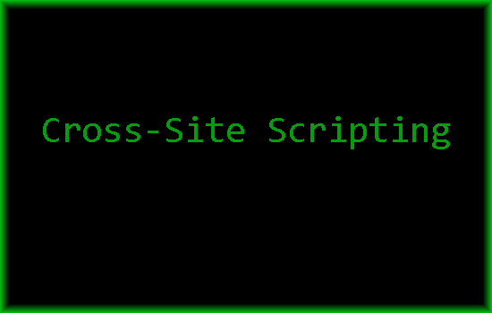

# XSS (Cross Site Scripting)



---
## Table:

* [WHOIS](#whois)
* [DETECT](#detect)

## WHOIS

In an XSS attack, the attacker injects an executable script into HTML pages 
viewed by the user. This means that to understand XSS, you’ll have to first 
understand JavaScript, PHP and HTML syntax.

### HTML Course

* [Learn HTML – Full Tutorial for Beginners 2022](https://youtu.be/kUMe1FH4CHE)

* [HTML Full Course - Build a Website Tutorial](https://youtu.be/pQN-pnXPaVg)

### PHP Course

* [PHP Programming Language Tutorial - Full Course](https://youtu.be/OK_JCtrrv-c)

### Javascript Course 

* [Learn JavaScript - Full Course for Beginners](https://youtu.be/PkZNo7MFNFg)

## DETECT 
You can XSS in any website that take input from user and print it in the page without anu check method.

### For example 

If you have a web page that has a search field and the value of search will print in the page, in this case you can inject javascript code like:
```javascript
<script>alert("XSS!")</script>
```
This well pop-up alert massage in the browser that contian > "XSS!"

*For more details: [XSS](https://www.bing.com/search?q=xss+portswigger)*

__or__

*Read [Bug Bounty Bootcamp-Chapter 6](https://drive.google.com/file/d/1P1sDB5xCI9Q_a4Qwnt_KjMhvb6jcthEk/view?usp=sharing)*


